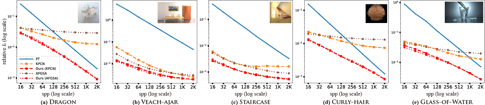

# [Neural James-Stein Combiner for Unbiased and Biased Renderings](https://cglab.gist.ac.kr/sa22neuraljs/)

[Jeongmin Gu](https://cglab.gist.ac.kr/people/), [Jose A. Iglesias-Guitian](http://www.j4lley.com/),[Bochang Moon](https://cglab.gist.ac.kr/people/bochang.html)



## Overview

This code is the official implementation of SIGGRAPH Asia 2022 paper, [Neural James-Stein Combiner for Unbiased and Biased Renderings](https://cglab.gist.ac.kr/sa22neuraljs/).
You can find the paper, supplementary report, and interactive viewer for more information on our website.

We have tested the code on Ubuntu 20.04 with NVIDIA GeForce RTX 3090 and Quadro RTX 8000 graphics cards.

## Requirements

We highly recommend running this code through [Docker](https://docs.docker.com/) and [Nvidia-docker](https://github.com/NVIDIA/nvidia-docker) on Ubuntu.
Please refer to the detailed instruction for the installation of [Docker](https://docs.docker.com/engine/install/ubuntu/) and [Nvidia-docker](https://docs.nvidia.com/datacenter/cloud-native/container-toolkit/install-guide.html#docker).


## Usage

### Building Docker image
```
docker build -t neuraljs .
```

Please use `run_docker.sh` to run it.

### Test (using pre-trained weights)

In order to test using the provided codes and data, you can proceed in the following order:

1. Prepare the test scenes (you can download the test scenes [here](https://drive.google.com/file/d/1ucot5_m9c6_lQYYdd9sFCm0fE32yDZBC/view?usp=share_link)) and  please please check the default directories in `main.py`
2. Download the pre-trained weights [here](https://drive.google.com/file/d/1YkXG-o6GducTJIGlfILtI_dOCaiKzIRr/view?usp=share_link) and unzip the downloaded checkpoints in `results` folder
3. Please check the list of SCENES and SPPS in `main.py` 
3. Run the below command in the terminal:
```
python main.py -m test 
```

### Train
1. Prepare training dataset and check the directories for dataset in `main.py`
```
python main.py -m train
```

### Validation
Note that we utilize the validation dataset for only retraining the previous works by following the official version of the codes (e.g., KPCN, AFGSA, DC and PD) and did not utilize the validation dataset for our method. We just took the checkpoints at final epochs. So, if you want to use the validation during the training, please make your own validation process.
 
### Build custom operators (CUDA) for Tensorflow 
```
cd ops
bash js.sh
```
## License

All source codes are released under a [BSD License](license).


## Citation

```

```

## Contact

If there are any questions, issues or comments, please feel free to send an e-mail to [jeong755@gm.gist.ac.kr](mailto:jeong755@gm.gist.ac.kr).

## Credits

We have used EXR I/O functionalities (`exr.py`) from [Kernel-Predicting Convolutional Networks for Denoising Monte Carlo Renderings (KPCN)](http://civc.ucsb.edu/graphics/Papers/SIGGRAPH2017_KPCN/) project.
